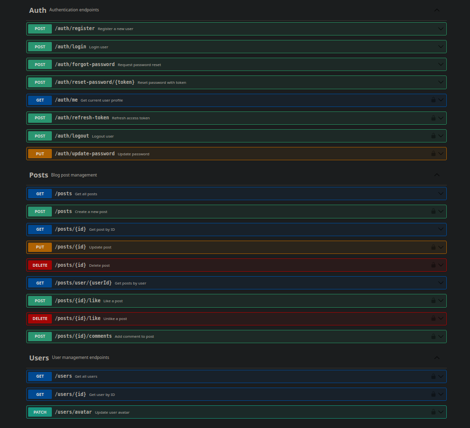
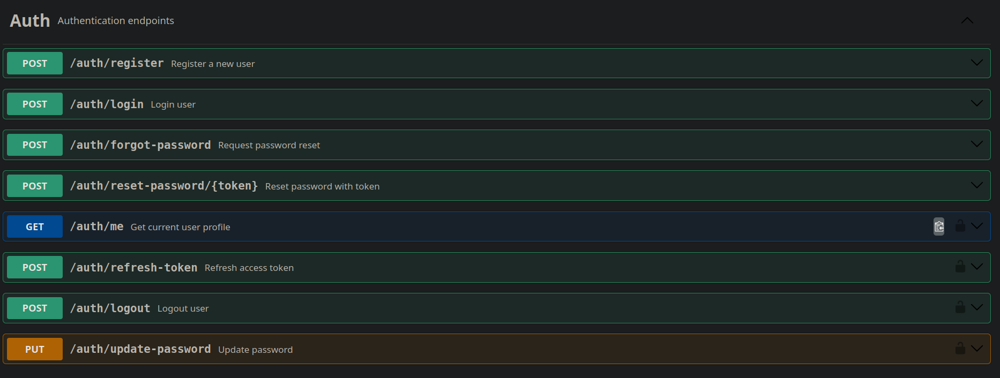
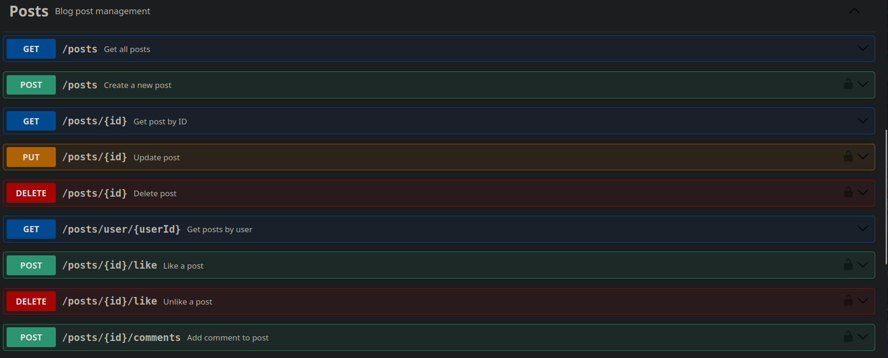
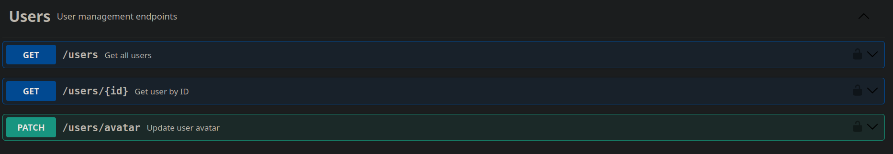

# Blog API

***Language***
- [🇪🇸 Español](./README.es.md)
- 🇺🇸 English

## Dependencies
```bash
# Debian
sudo apt install docker docker-compose

# Arch-Based
sudo pacman -S docker docker-compose
```

Clone repository
```bash[
git clone https://github.com/HGX64/Blog-Express-API
```

## Create .env file with your values
```env
NODE_ENV=development
PORT=3000
JWT_SECRET=very_long_secret_key
JWT_EXPIRE=30d
EMAIL_SERVICE=gmail
EMAIL_USERNAME=your@gmail.com
EMAIL_PASSWORD=your_password
FRONTEND_URL=""
MONGO_DATABASE=blog
MONGO_USER=admin
MONGO_PASSWORD=your_secure_password
MONGO_HOST=localhost
MONGO_PORT=27017
```

## Starting API
```bash
chmod +x start.sh
./start.sh
```

## API documentation
<p align="center">

</p>

# API usages
## Auth
<p align="center">

</p>

## Posts
<p align="center">

</p>

## Users
<p align="center">

</p>

# Extras
## Cookies
<p align="center">

</p>

