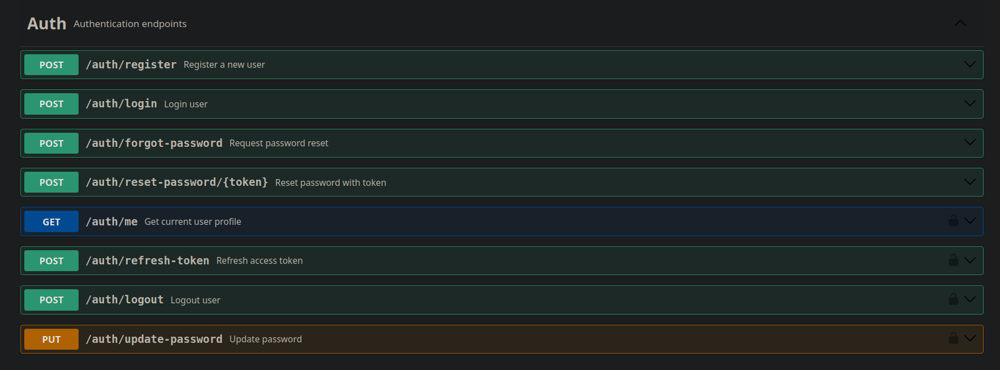
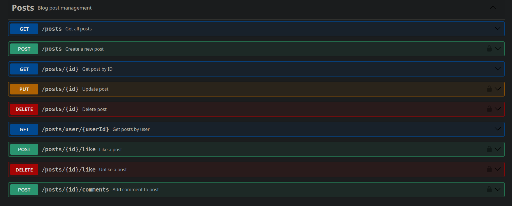
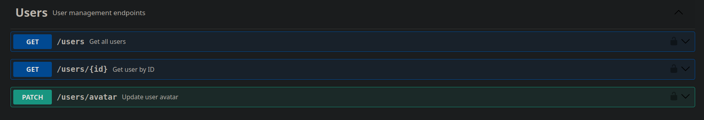
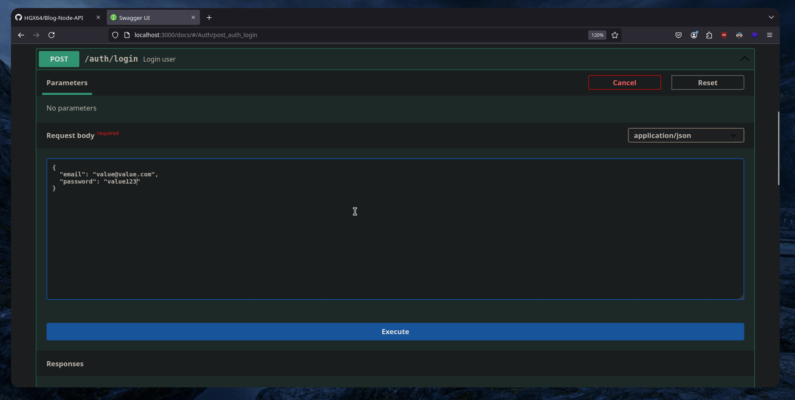
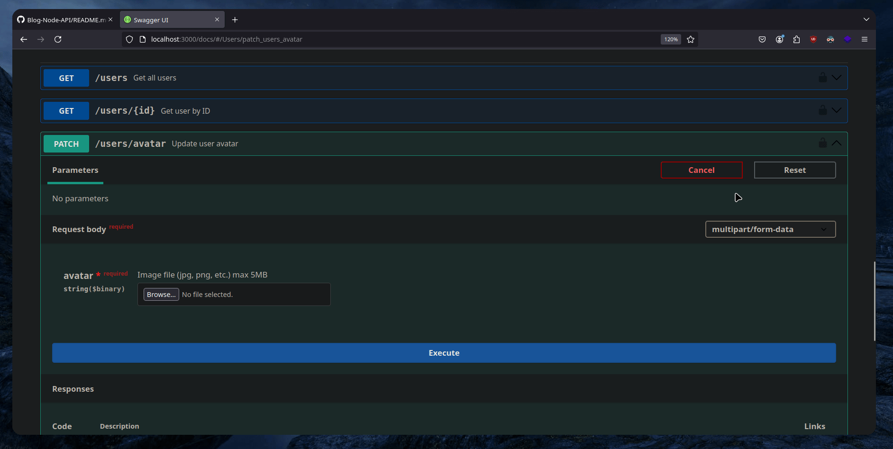

# Blog API

A simple and powerful Blog API built with Node.js, Express, and MongoDB. This API provides authentication, user management, and post creation functionality, allowing you to build a modern blog platform.

**Available Languages:**
- [🇪🇸 Español](./README.es.md)
- 🇺🇸 English (this version)

---

## 🛠️ Dependencies

To run this project, you need to have Docker and Docker Compose installed. You can install them using the following commands depending on your operating system:

### Debian/Ubuntu

```bash
sudo apt install docker docker-compose
```

### Arch Linux

```bash
sudo pacman -S docker docker-compose
```

---

## 📥 Clone the Repository

Clone this repository to your local machine using Git:

```bash
git clone https://github.com/HGX64/Blog-Express-API
```

---

## 📝 Setup Environment Variables

Before running the API, create a `.env` file in the root directory of the project with the following values:

```env
NODE_ENV=development                 # Set environment (development, production, etc.)
PORT=3000                            # API port (default is 3000)
JWT_SECRET=very_long_secret_key      # Secret key for JWT token generation
JWT_EXPIRE=30d                        # Expiry time for JWT tokens
EMAIL_SERVICE=gmail                   # Email service for sending emails (e.g., Gmail, SendGrid)
EMAIL_USERNAME=your@gmail.com        # Email account username
EMAIL_PASSWORD=your_password         # Email account password or app password
FRONTEND_URL="http://localhost:5173"  # URL of the frontend (if applicable)
MONGO_DATABASE=blog                  # MongoDB database name
MONGO_USER=admin                     # MongoDB username
MONGO_PASSWORD=your_secure_password  # MongoDB password
MONGO_HOST=localhost                 # MongoDB host (default is localhost)
MONGO_PORT=27017                     # MongoDB port (default is 27017)
```

Make sure to replace the placeholder values with your actual credentials and information.

---

## 🚀 Running the API

To start the API, follow these steps:

1. Make the `start.sh` script executable:
    ```bash
    chmod +x start.sh
    ```

2. Run the script to start the API:
    ```bash
    ./start.sh
    ```

This will start the server, and the API will be accessible on the port defined in your `.env` file (default is `3000`).

---

## 📡 API Endpoints

### Authentication

The authentication system includes functionality for logging in, registering, and refreshing JWT tokens. All authentication-related endpoints are secured using JWT.



---

### Posts

Create, read, update, and delete blog posts through the `/posts` endpoints. The system supports Markdown formatting and allows users to interact with posts via the API.



---

### Users

Manage user accounts, including registration, updating profile details, and viewing user information.



---

## 🍪 Extras

### Cookies

The API supports the use of cookies for user sessions and authentication.



---

### File Upload

The API allows users to upload files (e.g., images) to the server, with support for various file types and size limits.



---

## 💡 Additional Information

For further details or if you run into any issues, feel free to open an issue on the [GitHub Issues page](https://github.com/HGX64/Blog-Express-API/issues).

---

**Happy coding!** 🚀
